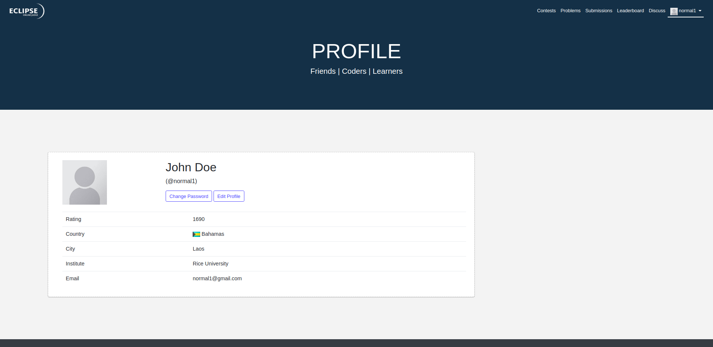

# EclipseOJ

> This project is an open-source Online Judge, a web application where users can host and participate in Competitive Programming contests.

You may want to check out the [report.pdf](/docs/report.pdf) file for more details on this project. It was made as the final project for CS 251 - **Software Systems Lab** course in Autumn 2017 at Indian Institute of Technology (IIT) Bombay, India.

## Screenshots

|                    Homepage                    |                  Login                   |                  Sign Up                   |
| :--------------------------------------------: | :--------------------------------------: | :----------------------------------------: |
|  |  |  |

|                   Profile                    |                  Contest List                  |                     Problem List                     |
| :------------------------------------------: | :--------------------------------------------: | :--------------------------------------------------: |
|  |  |  |

|                      Problem Statement                       |                      Running Contest                       |                   Submission List                    |
| :----------------------------------------------------------: | :--------------------------------------------------------: | :--------------------------------------------------: |
|  |  |  |

|                     Leaderboard                      |               Discussion Forum               |                    Code Editor                     |
| :--------------------------------------------------: | :------------------------------------------: | :------------------------------------------------: |
|  |  |  |

## Authors

* **Vamsi Krishna Reddy Satti** - [vamsi3](https://github.com/vamsi3)
* Vighnesh Reddy Konda - [scopegeneral](https://github.com/scopegeneral)
* Naman Jain - [Naman-ntc](https://github.com/Naman-ntc)

## Acknowledgements

- **Matt Mclnerney** for *Raleway* font and **Łukasz Dziedzic** for *Lato* font - for their beautiful open-source fonts; both used under the Open Font License.

## License

This project is licensed under the MIT License - see the [LICENSE](LICENSE) file for details.
